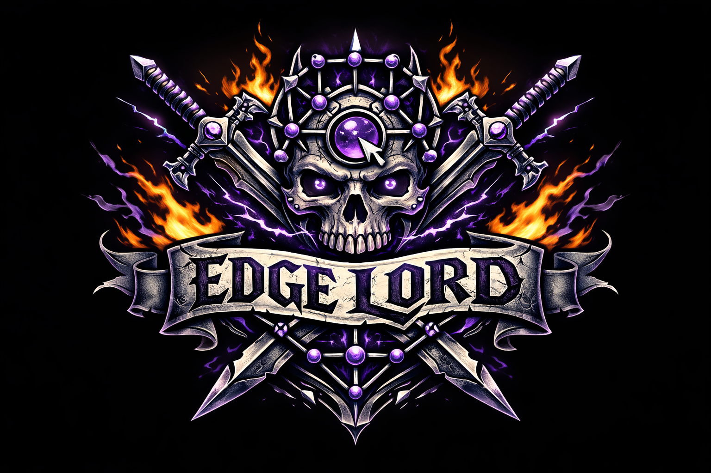

# EdgelorD LSP



`edgelord-lsp` is an editor-agnostic LSP 3.17 proof assistant server for Comrade Lisp.

## MVP0 Status

Implemented now:
- LSP lifecycle: initialize/initialized/shutdown/exit
- Text sync: didOpen/didChange/didSave/didClose
- Parse diagnostics publishing
- `textDocument/selectionRange`
- `textDocument/documentSymbol`
- Basic `hover` and wired `codeAction` surface

## Local Dependencies

- `codeswitch` (sister directory): `../codeswitch`
- `new_surface_syntax` (Comrade parser/elaborator):
  `../clean_kernel/satellites/src/surface_maclane/NewSurfaceSyntaxModule`

## Tests Added For MVP0

- `tests/selection_and_diagnostics.rs`
  - structural selection expansion shape (atom -> list -> form -> root)
  - parse diagnostic stability
- `tests/mvp0_utilities.rs`
  - UTF-16 position/offset roundtrips
  - deterministic incremental text-change application
  - deterministic top-level symbol extraction
  - selection-chain nesting validator behavior

## Run

```bash
cargo test
```

If your local rustup has no default toolchain configured, set one first:

```bash
rustup default stable
```

## Helix (project-local setup)

This repo now includes `.helix/languages.toml` so Helix can start `edgelord-lsp`
for `*.comrade` files without global editor config.

### Try it

```bash
hx path/to/file.comrade
```

If `cargo run --bin edgelord-lsp` works in this repo, Helix should attach LSP.

### Quick checks in Helix

- `:lsp-restart` to restart the language server after code changes
- `space k` for hover
- `space a` for code actions
- `space d` for diagnostics picker

### If you see `LSP not defined for the current document`

- Ensure the file ends with `.comrade`.
- Open Helix from this repo root so `.helix/languages.toml` is discovered.
- Run `:set-language comrade`, then `:lsp-restart`.
- If needed, run `:set-language scheme` (fallback wiring also enables LSP there).
